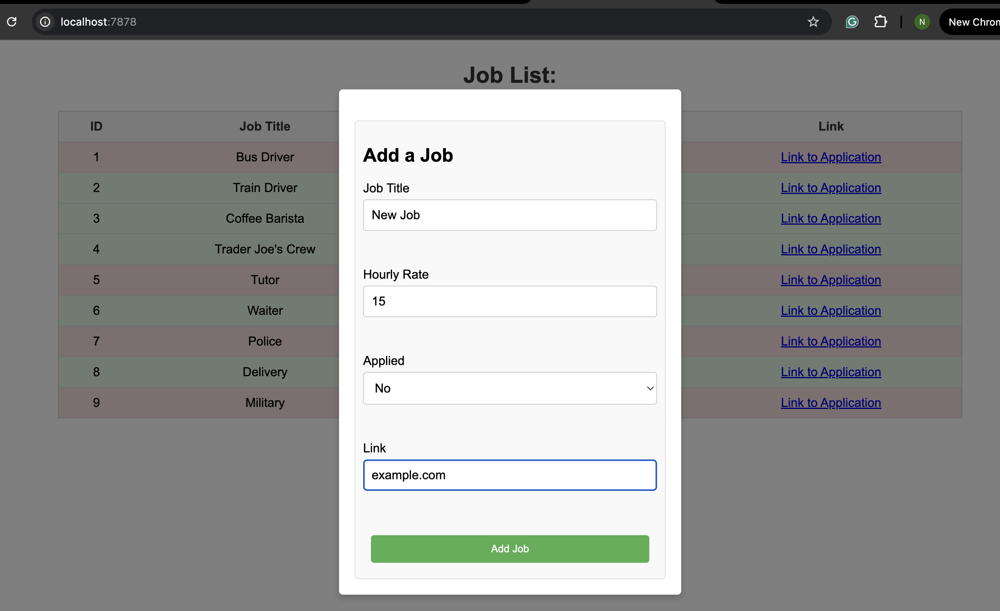

**Author:** Nathan Metens
**Class:** Rust 523

# Job Application List

A Rust-based project that helps you manage your job applications in an easy-to-use way. It allows you to view, add, remove, and update job listings from a SQLite database, all through a local server. The project features a neat front-end built with HTML, CSS, and JavaScript.

## Features

- **Add jobs:** Keep track of job listings by adding new positions.
- **Delete jobs:** Remove any job from the database by its *id* when no longer relevant.
- **Update job status:** Update the application status of a job, such as whether you've applied to it or not.
- **SQL commands:** Run custom SQL queries directly through the command line to interact with the job database.
- **Customizable port:** Run the server on a default port or specify your own.

## The Job Data

Each job in the database has an id, a job title, an hourly rate, an application status, and a link to the application on the web.

## Build The Project

Once inside the Project Directory, you can run either `cargo build` or `./run.sh build`.
I have implemented a `run.sh` bash script which explains all of the parts of how to work the project.

## Run The Project Screenshot

## Apllication Screenshot
The application:

Add a new Job:

Remove a Job by id:

### Resources
[File Handling](https://doc.rust-lang.org/std/fs/struct.File.html)
[CSV](https://docs.rs/csv/latest/csv/)
[Rust by Example](https://doc.rust-lang.org/rust-by-example/)
[chatgpt](https://chatgpt.com/)
[Markdown Cheat-Sheet](https://www.markdownguide.org/cheat-sheet/)
[Actix-Web](https://actix.rs/docs/)
[SQL in Rust](https://docs.rs/sqlite/latest/sqlite/)
[MIT License](https://opensource.org/license/MIT)
[Apache License](http://www.apache.org/licenses/LICENSE-2.0)
[HTML Cheat Sheet](https://www.codecademy.com/learn/learn-html/modules/learn-html-elements/cheatsheet)

## Licenses

### MIT License

Copyright (c) 2025 Nathan Metens 

Permission is hereby granted, free of charge, to any person obtaining a copy of this software and associated documentation files (the "Software"), to deal in the Software without restriction, including without limitation the rights to use, copy, modify, merge, publish, distribute, sublicense, and/or sell copies of the Software, and to permit persons to whom the Software is furnished to do so, subject to the following conditions:

The above copyright notice and this permission notice shall be included in all copies or substantial portions of the Software.

THE SOFTWARE IS PROVIDED “AS IS”, WITHOUT WARRANTY OF ANY KIND, EXPRESS OR IMPLIED, INCLUDING BUT NOT LIMITED TO THE WARRANTIES OF MERCHANTABILITY, FITNESS FOR A PARTICULAR PURPOSE AND NONINFRINGEMENT. IN NO EVENT SHALL THE AUTHORS OR COPYRIGHT HOLDERS BE LIABLE FOR ANY CLAIM, DAMAGES OR OTHER LIABILITY, WHETHER IN AN ACTION OF CONTRACT, TORT OR OTHERWISE, ARISING FROM, OUT OF OR IN CONNECTION WITH THE SOFTWARE OR THE USE OR OTHER DEALINGS IN THE SOFTWARE.

--

### Apache License, Version 2.0

Licensed under the Apache License, Version 2.0 (the "License"); you may not use this file except in compliance with the License. 

Unless required by applicable law or agreed to in writing, software
distributed under the License is distributed on an "AS IS" BASIS,
WITHOUT WARRANTIES OR CONDITIONS OF ANY KIND, either express or implied.
See the License for the specific language governing permissions and
limitations under the License.
